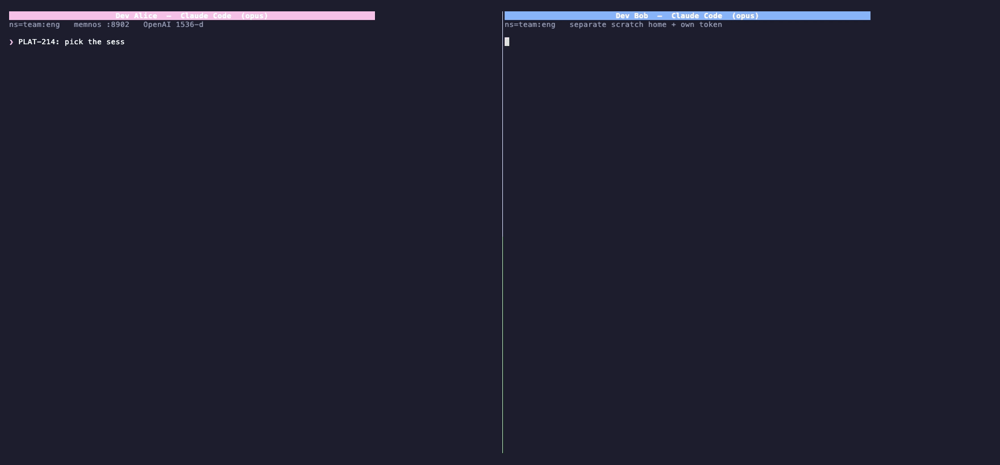
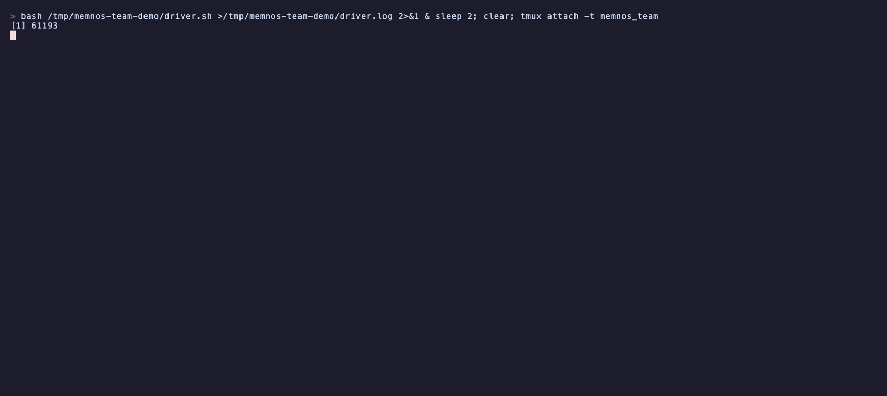

# memnos

[](https://github.com/thameema/memnos/actions/workflows/ci.yml)
[](LICENSE)
[](pyproject.toml)
[](#)
[](#)
[](benchmarks/README.md)
[](#benchmarks-and-how-we-report-them)
[](https://pypi.org/project/memnos/)

**Your AI forgets everything between sessions. memnos fixes that.**

memnos is a self-hosted memory server for AI agents. Your conversations are captured,
distilled into facts, and recalled in later sessions — across Claude Code, Cursor,
Windsurf, Codex, or anything that speaks MCP, REST, or an OpenAI/Anthropic-compatible
base URL. It runs on **one PostgreSQL + pgvector database** (no second vector store, no
graph database), uses **no LLM at query time**, and ships with governance — token auth,
namespace ACLs, audit log, and an encrypted secret vault — in the open-source build.

Apache-2.0 · self-hostable · single-org · local-first · `uv tool install memnos`


*It doesn't just remember — it knows what's true **now**: when a new fact contradicts an
old one, bi-temporal supersession closes the old fact out, and recall shows the transition.*

---

## Your AI remembers your repo. memnos remembers your team.

CLAUDE.md, Cursor rules, native model memory — all genuinely useful, and all the same
shape: **local and per-developer.** They sit on one machine, scoped to one repo or one
person's chat history. The knowledge that actually gets lost is *between* developers: the
decision a teammate made three sprints ago and why, the constraint nobody wrote down. That
never reaches the next engineer's agent.

memnos is one shared, governed memory the whole team's agents read and write — so a fact
one developer's agent learns is recallable by everyone else's, correctly attributed.



*Two **separate** Claude Code agents — different processes, different tokens, same
namespace (`ns=team:eng`). Alice's agent decides an auth approach; Bob's fresh agent (which
never saw her session) recalls it attributed **`by dev-alice`** and adds a constraint;
Alice's next turn picks up Bob's constraint, attributed **`by dev-bob`**. Bidirectional
shared memory across two real agents — server-stamped authorship (clients can't spoof it),
on your own Postgres, no LLM at recall time.*

The same proof at the CLI level, two `memnos` sessions on one namespace:



*Dev Bob's `recall` returns the decision Dev Alice stored, attributed `by dev-alice` — one
governed namespace, attribution stamped by the server, not the payload.*

**How memory gets captured is honest about its limits:** deterministic both-sides on Claude
Code (lifecycle hooks) and on any base-URL-configurable client via `memnos proxy`; MCP
capture is discretionary (the model chooses when to call the tools); ChatGPT and Claude
Desktop can't be cleanly auto-captured (no base-URL override, no cert MITM) — MCP is the
path there. Details in [Integrations](#integrations).

The concept (the gap, and why attribution must be server-stamped) is in
[`docs/team-memory.md`](docs/team-memory.md); standing up one shared host with a scoped
token per developer is in [`docs/guides/team.md`](docs/guides/team.md).

---

## Quickstart

**Prerequisite:** PostgreSQL **13+** with the **pgvector ≥ 0.7** extension. memnos does
**not** install Postgres — it connects to yours. No Postgres? `memnos setup --docker`
spins up a pgvector Postgres container for you.

Install into an isolated environment (`uv` recommended; `pipx` works too — don't
`pip install` into your system Python):

```bash
uv tool install memnos        # no uv?  brew install uv   or
                              #         curl -LsSf https://astral.sh/uv/install.sh | sh

memnos setup                  # enter your Postgres connection → creates schema + admin token
                              # (or: memnos setup --docker — needs Docker, zero Postgres setup)
memnos start                  # background server → open http://127.0.0.1:8900/admin
```

Operate it like any daemon: `memnos status` / `stop` / `restart`; `memnos serve` runs in
the foreground for systemd/launchd/Docker; `memnos upgrade` updates in place;
`memnos autostart` installs a login service so the server survives reboots.

During setup you're asked for an **optional OpenAI key** (stored AES-256-GCM encrypted,
never in plaintext): with one, you get 1536-d embeddings + bi-temporal fact extraction;
without one, memnos runs in free **local 384-d mode** — nothing leaves your machine.
For extraction without OpenAI, set `MEMNOS_EXTRACT_BASE_URL` to any OpenAI-compatible
endpoint (Ollama / vLLM / LM Studio) — embeddings stay local-384 and free, only fact
extraction calls that local LLM. `memnos migrate-embeddings` converts between embedding
modes losslessly if you change your mind.

Full walkthrough: [`QUICKSTART.md`](QUICKSTART.md) · Windows:
[`docs/guides/windows.md`](docs/guides/windows.md) · everything else: `memnos --help`.

---

## What makes it different

- **It knows what's true *now*.** Facts are bi-temporal (when it happened vs. when memnos
  learned it). Single-valued facts (`lives_in`, `works_at`) supersede on contradiction —
  by rule, not by asking an LLM — so "where do I live?" returns the current answer, with
  the old one closed out, dated, and still auditable.
- **One engine.** Everything lives in a single PostgreSQL + pgvector — no second vector
  store, no graph database to run, scale, secure, or back up.
- **No LLM at query time.** Recall is one embedding lookup (fully on-device in local
  mode), hybrid search (pgvector HNSW + BM25, fused with RRF), a local ONNX cross-encoder
  rerank, then quota/timeline/entity guarantees. No generative call — fast, cheap,
  deterministic.
- **Governed by default.** Token auth, namespace ACLs, audit log, usage/cost ledger,
  server-stamped author attribution, and an encrypted secret vault with ingest
  redaction — in the open-source build, not an enterprise tier.
- **Vendor-neutral, self-hosted.** Apache-2.0, your Postgres, your data, your LLM keys
  (never stored in plaintext). The REST API is an OpenAPI 3.1 contract enforced in CI;
  the CLI is smoke-tested on Linux, macOS, and Windows on every push.

memnos is a *governed memory engine*, not an agent runtime. A detailed, version-pinned
comparison with other memory systems lives at
**[memnos.net/compare](https://memnos.net/compare.html)**.

---

## Integrations

One command wires memnos into your agent — no manual config editing:

```bash
memnos agent-setup claude-code     # Claude Code: MCP + hooks (auto recall/save) + /memnos
memnos agent-setup claude-desktop  # Claude Desktop
memnos agent-setup codex           # Codex CLI
memnos agent-setup cursor          # Cursor
memnos agent-setup windsurf        # Windsurf
memnos agent-setup openclaw        # OpenClaw
memnos agent-setup hermes          # Hermes Agent (Nous Research)
```

Each mints a scoped token, is idempotent, and backs up any file it edits.

**Honest capture tiers** — clients differ in how reliably memory gets captured, and we'd
rather tell you than pretend otherwise:

1. **Deterministic (Claude Code):** lifecycle hooks auto-recall before each prompt and
   auto-save after — both your message and the assistant's reply. No model discretion.
2. **Deterministic (any base-URL client) — `memnos proxy`:** point any OpenAI- or
   Anthropic-compatible client at the proxy
   (`ANTHROPIC_BASE_URL=http://127.0.0.1:8910`). It relays every request untouched
   (streaming included, keys forwarded, never stored) and captures both sides of each
   completed exchange, with agent-loop noise filtered out.
   [Guide + capability matrix](docs/guides/proxy.md).
3. **Discretionary (everything else):** MCP tools (`recall`, `recall_wide`, `remember`,
   `reconcile_claim`, …) — called when the model decides to. Useful, but not guaranteed.

Also: **REST** (`POST /remember`, `POST /recall` — Bearer token, namespace-scoped),
**CLI** (`memnos remember/recall`), and an **SDK** (`uv pip install memnos-sdk`) with
LangChain / LangGraph / LlamaIndex adapters. Client guides:
[`docs/guides/clients/`](docs/guides/clients/README.md).

REST, MCP, hooks, and the benchmark all run the **same engine** — there is one codebase,
not a benchmarked copy and a shipped copy.

---

## Management console

A zero-build web console ships in the open-source build at **`/admin`**: create
namespaces, mint/revoke tokens, manage grants, view the dashboard, store secrets. Every
call is token-authenticated, namespace-ACL'd, and audited.

```bash
memnos admin          # bootstrap an admin token → paste into /admin
```

---

## Benchmarks (and how we report them)

**LongMemEval: 78.4%** on the full 500-question benchmark (gpt-4o answer + judge), run on
[MemoryBench](https://github.com/supermemoryai/memorybench) — a competitor's own open
harness. By category: single-session assistant facts 98.2%, user facts 92.9%,
knowledge-update tracking 78.2% (with 99% retrieval Hit@10 — the engine found the answer;
the answering model missed it), temporal reasoning 77.4%, multi-session 70.7%. The weak
spot, disclosed: single-session *preferences* 46.7% (n=30) — preference statements aren't
fact-shaped, and extraction underserves them today.

**LoCoMo: 64–65% under the gpt-4o judge** on the full benchmark (10 conversations,
1,542 QA), reproduced across **three independent from-scratch ingests** (the small spread
is non-deterministic extraction, not the engine). Every prediction file is published
under [`benchmarks/results/`](benchmarks/results/).

We care more about *credibility* than a big headline:

- **Setup:** full 10 conversations. Ingest → bi-temporal SPO fact extraction
  (gpt-4o-mini) + consolidation; retrieve via hybrid search (pgvector + BM25, RRF) +
  cross-encoder rerank + timeline / entity-guarantee arms — **no LLM at query time**;
  answer with the calling agent; judge with an LLM.
- **Judge transparency:** the score is judge-sensitive. On the *same answers* we measure
  a **strict ~44% / lenient 85–88%** band around the standard 64–65% — so you can see how
  much the judge prompt alone moves any published number.
- **Independent judging:** most published numbers are *self-judged* (the same vendor's
  model grades its own answers). We additionally score under an independent provider's
  judge (Claude grading GPT answers) to surface self-preference bias.
- **On comparisons:** headline numbers elsewhere are typically self-judged and sometimes
  on a *different* benchmark (e.g. DMR, not LoCoMo). We don't claim parity — we publish a
  reproducible harness.

**Reproduce:** `python benchmarks/locomo_eval.py --sample-ids 0,1,2,3,4,5,6,7,8,9`
(see [`benchmarks/`](benchmarks/README.md)).

*We'd rather report a credible 64–65% with the judge ladder disclosed than an inflated
85% under a lenient one.*

---

## How it works

```
Claude Code ─┐
Cursor       ├─ MCP (stdio) ─┐
Windsurf     ─┘              │
hooks / proxy ──────────────┼─► memnos server ──► PostgreSQL + pgvector  (ONE engine)
REST / CLI ─────────────────┘     ├─ hybrid retrieve: pgvector (HNSW) + BM25 (tsvector) → RRF
                                   │   → cross-encoder rerank → quota + timeline + entity arms
                                   │   (NO LLM at query time)
                                   ├─ bi-temporal facts + belief-change supersession
                                   ├─ governance: token auth · namespace ACL · audit · usage
                                   └─ encrypted secret vault (AES-256-GCM) + ingest redaction
```

**Write** (LLM at ingest only): a message becomes a verbatim raw turn **and** structured
bi-temporal SPO facts. Near-duplicate facts are deduplicated on the write path.
Single-valued attributes supersede on change; multi-valued ones (`did`, `visited`)
accumulate. Memories can be **typed**, and memories typed `constraint` are **pinned** —
injected into every recall in their namespace. Secrets are redacted before storage. An
offline "sleep" pass consolidates facts into entity dossiers, and `reconcile` re-runs
contradiction close-out across an existing namespace.

**Read** (no LLM): hybrid retrieval (pgvector HNSW + BM25, RRF-fused), cross-encoder
rerank, quota guarantees for raw-turn + fact coverage. Temporal questions add a
guaranteed entity **timeline**; entity questions add an **entity-guarantee** arm so
list/aggregation answers are complete. Recall is **grounded**: results carry their source
namespace, and provenance links trace facts back to the turns they came from.

---

## Security & operations

- **Auth:** opaque bearer tokens (SHA-256 hashed at rest; instantly revocable — not JWTs).
- **ACL:** every read/write is clamped to the principal's namespace grants.
- **Attribution:** the server stamps the authenticated principal as author — clients
  can't spoof it via the request body.
- **Audit + usage ledger:** who/what/when + per-op LLM cost.
- **Secret vault:** AES-256-GCM, value-refs (`secret://name`), key rotation.
- **Redaction:** secret-shaped text is stripped from remembered messages before storage.
- **Health heuristic:** `memnos health` turns metrics into actionable findings.

> Local-first: the server binds `127.0.0.1`. Put a TLS reverse proxy in front for remote use.

---

## Status & limitations

memnos is **early (0.1.x)** and changing. Honest scope, so you don't find out the hard way:

- **Single-org.** Namespaces and ACLs within one deployment — no multi-tenant control
  plane in the open-source build.
- **Local-first.** Binds `127.0.0.1` by default; remote access is your reverse proxy's job.
- **Text only.** No image/audio/multimodal memory.
- **Fact extraction needs an LLM — but not necessarily OpenAI.** Point
  `MEMNOS_EXTRACT_BASE_URL` at any OpenAI-compatible endpoint (Ollama / vLLM / LM Studio)
  to run extraction locally and free, while embeddings stay on the private local-384 path.
  With nothing set, local mode still gives you embeddings + hybrid recall over verbatim
  turns — but no fact extraction, so no supersession or timelines.
- **Capture guarantees vary by client.** Deterministic only via Claude Code hooks or the
  proxy; plain MCP capture depends on the model choosing to call the tools (see
  [Integrations](#integrations)).
- **Benchmarked, not magic.** 78.4% on LongMemEval (500q, full run) and 64–65% on LoCoMo
  under the standard judge — published with the judge ladder because those numbers move a
  lot depending on who grades them.

---

## License

Apache-2.0. The open-source build is the engine + single-org self-host + the basic
management console. SSO/advanced RBAC, encrypted-vault key management (KMS/HSM, rotation
policies), the multi-tenant control plane, the richer enterprise UI, and managed cloud
are the commercial layer.
